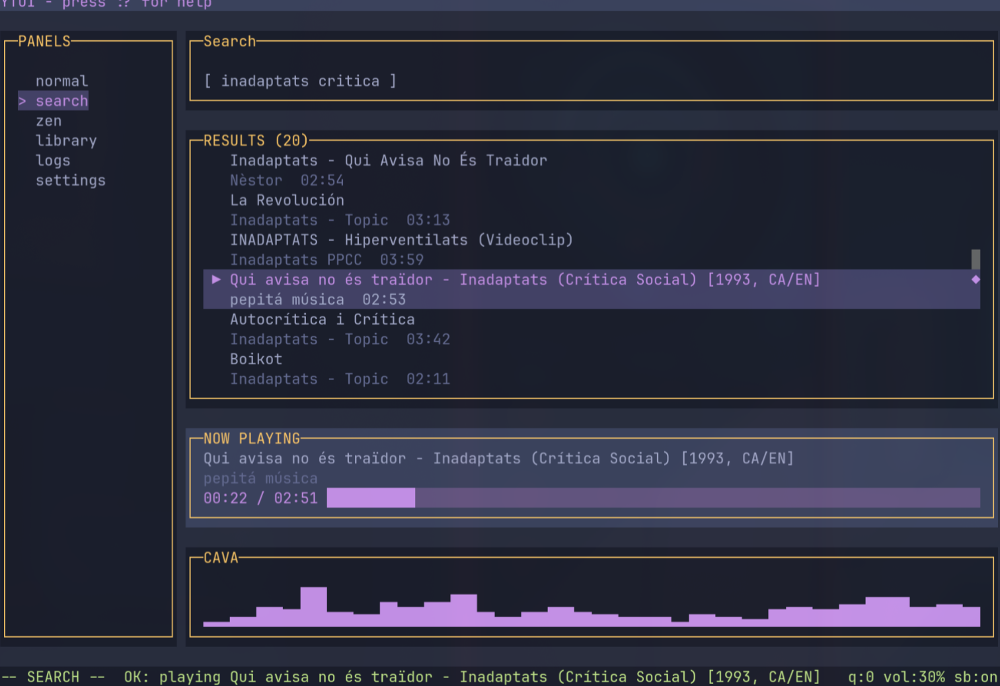

# ytui



A vim-inspired terminal music player powered by YouTube.

```
bun install
bun run src/main.ts
```

**Modes:** `NORMAL` · `SEARCH` · `ZEN`

**Commands:** `:q` quit · `:?` help · `:theme pick` themes · `:provider list` providers · `:plugin list` plugins

**Themes:** gruvbox · nord · matrix · palenight · dracula · catppuccin · one-dark · tokyo-night

**Keybinds:** `j/k` navigate · `/` search · `:` command · `Enter` play · `q` quit

Plugins live in `~/.config/ytui/plugins/` — config at `~/.config/ytui/ytui.conf`.
